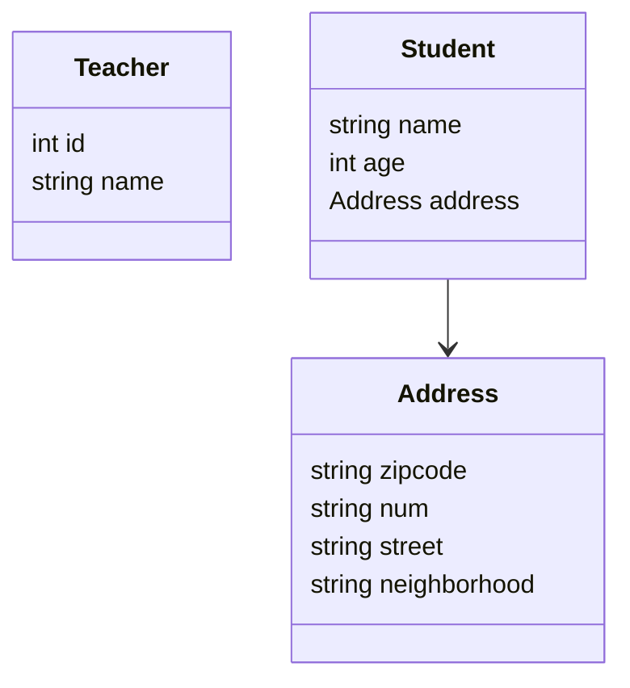

```mermaid
classDiagram
    class Teacher {
        int    id
        string name
    }

    class Student {
        string  name
        int     age
        Address address
    }

    class Address {
        string  zipcode
        string  num
        string  street
        string  neighborhood
    }

    Student --> Address
```
