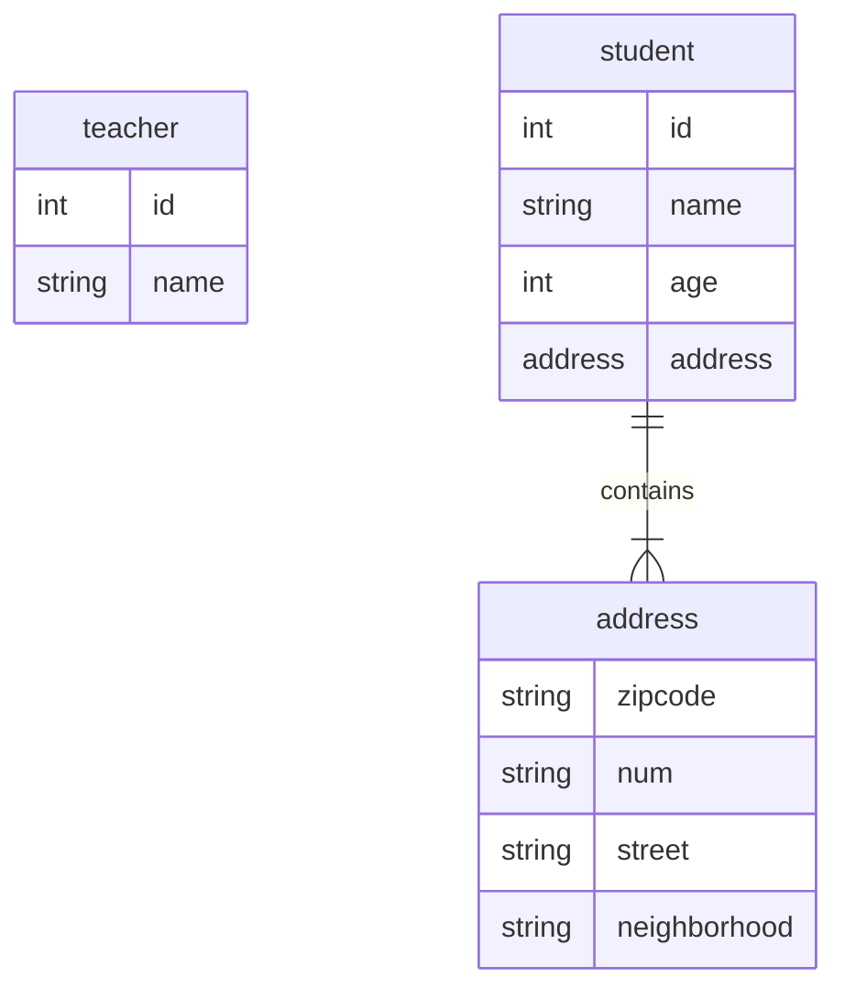

```mermaid
erDiagram
    teacher {
        int     id
        string  name
    }

    student {
        int     id
        string  name
        int     age
        address address
    }

    address {
        string  zipcode
        string  num
        string  street
        string  neighborhood
    }

    student ||--|{ address : contains

```
